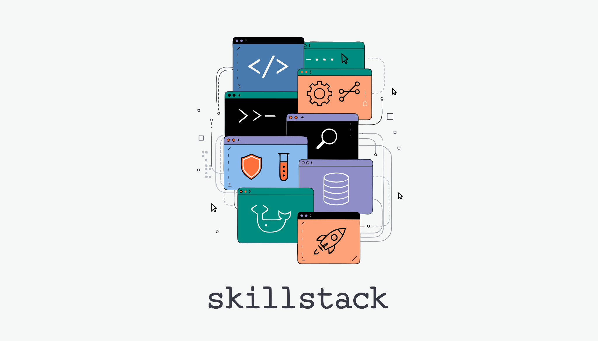

<div align="center">

</div>

# Claude Skills Marketplace

34 individually installable expert plugins for AI coding assistants. First-class support for Claude Code with marketplace install. Works with Cursor, Windsurf, Copilot, Cline, aider, and any AI tool that reads project files.

```
/plugin marketplace add viktorbezdek/claude-skills
/plugin install python-development@claude-skills
```

<div align="center">

**[Install](#installation)** &middot; **[Browse Plugins](#plugin-catalog)** &middot; **[Examples](#usage-examples)** &middot; **[Other AI Tools](#using-with-other-ai-tools)** &middot; **[Contributing](#contributing)**

</div>

---

## Installation

### Add the marketplace

```
/plugin marketplace add viktorbezdek/claude-skills
```

### Install plugins

```
/plugin install api-design@claude-skills
/plugin install debugging@claude-skills
/plugin install react-development@claude-skills
```

Plugins activate automatically — mention "REST API" and the `api-design` plugin loads. Say "pytest fixtures" and `testing-framework` kicks in. No special syntax.

### Install from CLI

```bash
claude plugin marketplace add viktorbezdek/claude-skills
claude plugin install python-development@claude-skills
```

---

## Using with Other AI Tools

Every plugin is standard markdown with scripts and templates. The knowledge works with any AI coding assistant that reads project context.

### Cursor

Copy a plugin's skill into your project or reference it in `.cursorrules`:

```bash
cp claude-skills/python-development/skills/python-development/SKILL.md .cursorrules
```

### Windsurf / Codeium

Add plugin directories to your project workspace. Windsurf indexes markdown files automatically.

### GitHub Copilot

Copy skill content into `.github/copilot-instructions.md`:

```bash
cat claude-skills/api-design/skills/api-design/SKILL.md >> .github/copilot-instructions.md
```

### Cline / Continue.dev / aider

Add plugin directories to your project. These tools read project files for context and will pick up the patterns, templates, and examples.

### What's universal vs Claude-specific

| Feature | Works everywhere | Claude Code only |
|---------|-----------------|-----------------|
| 785+ markdown guides and references | Yes | Yes |
| 500+ templates and scripts | Yes | Yes |
| Code examples and patterns | Yes | Yes |
| Automatic trigger-based activation | — | Yes |
| One-command plugin install | — | Yes |

---

## Usage Examples

```
"Design a REST API for a multi-tenant SaaS billing system"
→ api-design plugin: REST patterns, auth strategies, pagination

"My Next.js app hydration fails only in production"
→ debugging plugin: systematic root cause analysis

"Review this PR for security issues"
→ code-review plugin: multi-agent analysis (security + performance + style)

"Create a production Docker setup for my FastAPI app"
→ docker-containerization plugin: optimized multi-stage Dockerfiles

"Write pytest tests for this auth service with edge cases"
→ test-driven-development plugin: Red-Green-Refactor test suites
```

---

## Plugin Catalog

> Click any plugin name for detailed documentation, file listings, and usage examples.

### Development

| Plugin | Install | Description |
|--------|---------|-------------|
| **[python-development](python-development/)** | `/plugin install python-development@claude-skills` | Modern Python with uv, ruff, mypy, pytest, FastAPI, async patterns |
| **[typescript-development](typescript-development/)** | `/plugin install typescript-development@claude-skills` | Zod/TypeBox validation, Clean Architecture, branded types, strict tsconfig |
| **[react-development](react-development/)** | `/plugin install react-development@claude-skills` | React 19, hooks optimization, Bulletproof React, accessibility |
| **[nextjs-development](nextjs-development/)** | `/plugin install nextjs-development@claude-skills` | Next.js 16 App Router, Server Components, caching strategies |
| **[frontend-design](frontend-design/)** | `/plugin install frontend-design@claude-skills` | Tailwind/shadcn/Radix, WCAG 2.1 AA, design tokens |
| **[prompt-engineering](prompt-engineering/)** | `/plugin install prompt-engineering@claude-skills` | 4-D optimization framework, A/B testing, eval rubrics |
| **[skill-creator](skill-creator/)** | `/plugin install skill-creator@claude-skills` | Create your own skills with progressive disclosure and validation |

### DevOps & Infrastructure

| Plugin | Install | Description |
|--------|---------|-------------|
| **[cicd-pipelines](cicd-pipelines/)** | `/plugin install cicd-pipelines@claude-skills` | GitHub Actions, GitLab CI, Terraform, DevSecOps, semantic versioning |
| **[docker-containerization](docker-containerization/)** | `/plugin install docker-containerization@claude-skills` | Multi-stage builds, Docker Compose, worktree isolation |
| **[git-workflow](git-workflow/)** | `/plugin install git-workflow@claude-skills` | Conventional commits, changelog generation, worktree management |

### Quality & Testing

| Plugin | Install | Description |
|--------|---------|-------------|
| **[test-driven-development](test-driven-development/)** | `/plugin install test-driven-development@claude-skills` | Red-Green-Refactor for pytest, Vitest, Playwright |
| **[testing-framework](testing-framework/)** | `/plugin install testing-framework@claude-skills` | Unit, E2E, component, accessibility, mutation, fuzz testing |
| **[debugging](debugging/)** | `/plugin install debugging@claude-skills` | Chrome DevTools automation, systematic root cause analysis |
| **[code-review](code-review/)** | `/plugin install code-review@claude-skills` | Multi-agent swarm review (security + performance + style) |

### API & Architecture

| Plugin | Install | Description |
|--------|---------|-------------|
| **[api-design](api-design/)** | `/plugin install api-design@claude-skills` | REST, GraphQL, gRPC, OpenAPI, auth, pagination, rate limiting |
| **[mcp-server](mcp-server/)** | `/plugin install mcp-server@claude-skills` | Build MCP servers with FastMCP (Python) or TypeScript |

### Documentation & Automation

| Plugin | Install | Description |
|--------|---------|-------------|
| **[documentation-generator](documentation-generator/)** | `/plugin install documentation-generator@claude-skills` | 6-phase doc generation, 24 templates, drift detection |
| **[workflow-automation](workflow-automation/)** | `/plugin install workflow-automation@claude-skills` | CI/CD automation, FABER state machine, release management |

### Strategic Thinking

| Plugin | Install | Description |
|--------|---------|-------------|
| **[creative-problem-solving](creative-problem-solving/)** | `/plugin install creative-problem-solving@claude-skills` | Game theory, first principles, lateral thinking, SCAMPER |
| **[critical-intuition](critical-intuition/)** | `/plugin install critical-intuition@claude-skills` | Pattern recognition, Bayesian reasoning, bias detection |

### Helper Plugins

Focused frameworks for specific tasks. Install individually or as companions to the plugins above.

| Plugin | Install | What it Does |
|--------|---------|-------------|
| **[consistency-standards](consistency-standards/)** | `/plugin install consistency-standards@claude-skills` | Naming conventions, style guides |
| **[content-modelling](content-modelling/)** | `/plugin install content-modelling@claude-skills` | CMS schemas, content types |
| **[edge-case-coverage](edge-case-coverage/)** | `/plugin install edge-case-coverage@claude-skills` | Boundary conditions, error scenarios |
| **[example-design](example-design/)** | `/plugin install example-design@claude-skills` | Progressive complexity examples |
| **[navigation-design](navigation-design/)** | `/plugin install navigation-design@claude-skills` | Information architecture, wayfinding |
| **[ontology-design](ontology-design/)** | `/plugin install ontology-design@claude-skills` | Knowledge models, taxonomies |
| **[outcome-orientation](outcome-orientation/)** | `/plugin install outcome-orientation@claude-skills` | OKRs, success metrics |
| **[persona-definition](persona-definition/)** | `/plugin install persona-definition@claude-skills` | User personas, empathy maps |
| **[persona-mapping](persona-mapping/)** | `/plugin install persona-mapping@claude-skills` | Stakeholder analysis, RACI |
| **[prioritization](prioritization/)** | `/plugin install prioritization@claude-skills` | RICE, MoSCoW, ICE scoring |
| **[risk-management](risk-management/)** | `/plugin install risk-management@claude-skills` | Risk registers, mitigation strategies |
| **[systems-thinking](systems-thinking/)** | `/plugin install systems-thinking@claude-skills` | Feedback loops, leverage points |
| **[user-journey-design](user-journey-design/)** | `/plugin install user-journey-design@claude-skills` | Journey maps, touchpoints |
| **[ux-writing](ux-writing/)** | `/plugin install ux-writing@claude-skills` | Microcopy, error messages |

---

## Plugin Structure

Each plugin follows the Claude Code plugin convention:

```
plugin-name/
├── .claude-plugin/
│   └── plugin.json            # Plugin manifest
├── skills/
│   └── plugin-name/
│       ├── SKILL.md           # Core instructions (AI reads this)
│       ├── references/        # Deep-dive guides
│       ├── templates/         # Copy-paste boilerplates
│       ├── scripts/           # Automation utilities
│       └── examples/          # Runnable code
├── commands/                  # Slash commands (if any)
└── README.md                  # Human documentation
```

---

## Contributing

1. Create a directory with `.claude-plugin/plugin.json` and `skills/<name>/SKILL.md`
2. Add references, templates, scripts, and examples inside the skill directory
3. Add a `README.md` at the plugin root
4. Submit a pull request

### Quality Checklist

- [ ] `.claude-plugin/plugin.json` has name, version, description
- [ ] `skills/<name>/SKILL.md` has valid YAML frontmatter with triggers
- [ ] Examples are complete and runnable
- [ ] `README.md` documents all included files

---

## License

MIT License. See [LICENSE](LICENSE) for details.

---

<div align="center">

**34 plugins. Install what you need. Works with any AI coding assistant.**

</div>
