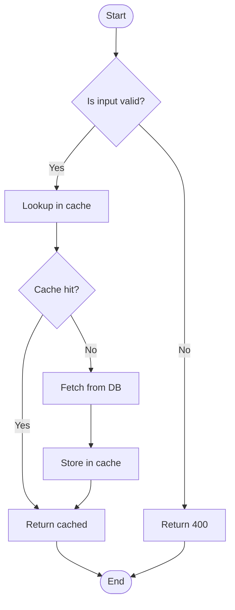
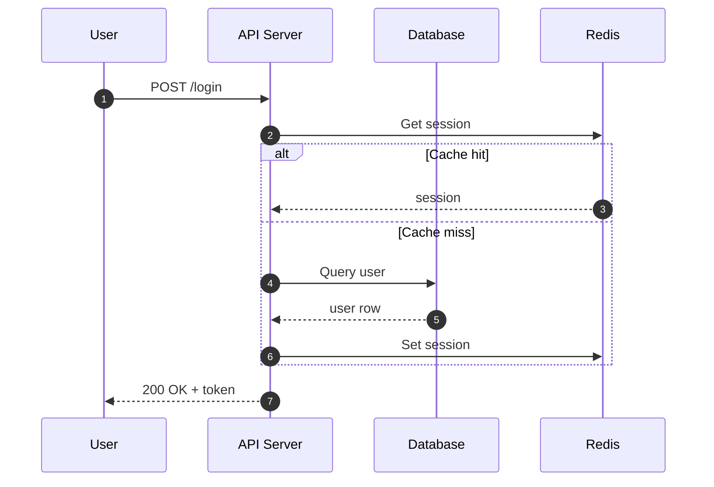
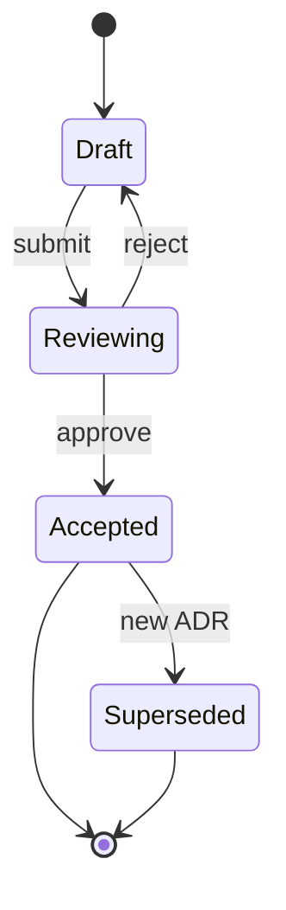
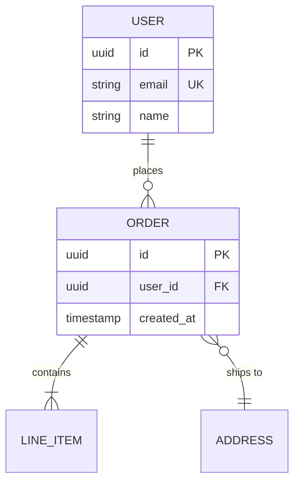

# Visual Communication

A diagram is not decoration — it is compression. If three paragraphs describe the same flow a diagram shows in 20 seconds, the diagram wins. If a diagram takes ten minutes to read, the paragraphs won.

## When a diagram beats prose

| Signal | Diagram |
|---|---|
| The reader needs to understand a process with branches | Flowchart |
| The reader needs to see *who talks to whom and when* | Sequence diagram |
| The reader needs to understand state transitions | State diagram |
| The reader needs to see *what depends on what* | Component / dependency diagram |
| The reader needs the data model | ER diagram |
| The reader needs the big picture of a system | C4 diagram |
| The reader needs a 2×2 trade-off / matrix | Quadrant / matrix |

When a diagram does NOT beat prose:

- Simple linear sequences (1 → 2 → 3) — a list is clearer.
- Content-heavy ideas — diagrams force compression that loses nuance.
- When the diagram would have 30+ nodes — split or describe.
- When the reader needs exact values — a table beats a chart.

## Picking the right diagram

```
Flow-oriented (what happens in what order)?
├── With branches/decisions → flowchart
├── Between actors/components over time → sequence diagram
└── With explicit states → state diagram

Structure-oriented (how is it organized)?
├── Data → ER diagram
├── Code → class diagram
├── System at high level → C4 diagram
└── Components + dependencies → dependency graph

Comparison-oriented?
├── 2 dimensions, 4 quadrants → quadrant chart
└── N options, M criteria → matrix / table (often not a diagram)
```

Full decision tree with worked examples in `references/diagram-selection-matrix.md`.

## Mermaid is the default

Mermaid is the best default for engineering diagrams because:

- Text-based → versionable in git.
- Renders natively in GitHub, GitLab, Notion, Obsidian, VS Code.
- Low cost to edit; no image file to re-export.
- Adequate for 90% of diagrams engineering teams draw.

Use PNG/SVG diagrams only when Mermaid cannot express the idea (complex physical diagrams, highly custom layouts).

## Mermaid templates

### Flowchart



Rules:
- `TD` (top-down) or `LR` (left-right). Avoid `BT` / `RL` — readers expect top-down or left-right.
- Decision nodes `{}` have explicit `|Yes|` / `|No|` labels.
- Start and end nodes use `()`.
- Node IDs short; labels readable.

### Sequence diagram



Rules:
- `autonumber` adds step numbers — makes the diagram referenceable.
- Use `alt` / `else` for branches, `loop` for retries, `par` / `and` for parallelism.
- Arrows: `->>` solid (sync), `-->>` dashed (async/return).

### State diagram



Rules:
- `[*]` = start/end.
- Transition labels name the event that triggers the transition.
- Every state has at least one outbound transition or is terminal.

### ER diagram



Cardinality:
- `||--o{` one-to-many (1 to 0-or-more)
- `||--|{` one-to-many (1 to 1-or-more)
- `||--||` one-to-one
- `}o--o{` many-to-many

Full Mermaid cheat sheet with class, gitGraph, pie, and quadrant in `references/mermaid-cheatsheet.md`.

## The C4 model

C4 structures software architecture diagrams at four zoom levels:

| Level | Shows | Audience |
|---|---|---|
| **Context** | Your system + users + external systems | Any stakeholder |
| **Container** | Applications / services inside your system | Tech leads, architects |
| **Component** | Major components inside a container | Developers |
| **Code** | Classes / modules inside a component | Developers (rarely needed) |

Rules:
- Most teams need only Context + Container. Component diagrams for complex services. Code-level rarely.
- Each level should fit on one screen. If not, the scope is wrong.
- Legend required — what is a box, what is an arrow, what are the styles.

C4 can be rendered in Mermaid using `C4Context` / `C4Container`, or via dedicated tools like Structurizr. See `references/c4-model-guide.md` for the four levels with worked examples.

## Diagram-as-code principles

- **Checked into the repo** with the code it describes. Diagrams drift faster than code; proximity helps.
- **Updated in the PR that changes the system.** Reviewers catch staleness.
- **Consistent style** across diagrams. Same shape = same concept.
- **Labeled arrows** — an unlabeled arrow is a puzzle.
- **Direction matters** — request arrows point one way, data flow another; pick conventions and stick to them.

## Anti-patterns

- **Decoration diagrams** — added because docs look incomplete without one. If the diagram conveys nothing, delete it.
- **Mystery boxes** — boxes without labels or with jargon-only labels. Every box has a purpose that must be readable.
- **Unlabeled arrows** — arrows without direction semantics. The reader guesses.
- **Everything-on-one-diagram** — 40 boxes, 80 arrows, unreadable. Split into zoom levels (C4) or per-flow diagrams.
- **Wrong diagram type** — a sequence diagram where a flowchart was needed, or vice versa. Match diagram to the question.
- **Out-of-date diagrams** — worse than no diagram. Readers act on stale information.
- **Image files instead of code** — PNG/JPG in the repo. Nobody updates them.
- **C4 without legend** — readers don't know what the shapes mean.

## Workflow

1. **Decide whether a diagram helps.** If prose is ≤3 paragraphs and linear, skip.
2. **Pick the diagram type.** Flow? Sequence? State? Structure? Use the decision tree.
3. **Draft in Mermaid.** Simple case first — no styling.
4. **Review for readability.** Can a reader unfamiliar with the system follow it in 60 seconds?
5. **Label everything.** Arrows, nodes, groups. No orphans.
6. **Check the diagram into the repo** next to the code it describes.
7. **Update with the PR** that changes the system.

## References

| File | Contents |
|---|---|
| `references/mermaid-cheatsheet.md` | Full Mermaid syntax for flowchart, sequence, state, ER, class, gitGraph, pie, quadrant |
| `references/diagram-selection-matrix.md` | When to use which diagram type; worked examples; when NOT to diagram |
| `references/c4-model-guide.md` | The four C4 levels, when to stop, worked examples, Mermaid templates |

## Related skills

- **structured-writing** — diagrams inside a BLUF-style doc.
- **stakeholder-alignment** — architecture diagrams inside RFCs.
- **documentation-discipline** — when to check a diagram into the repo.
- **frontend-design** — UI/UX mockups and visual design (different domain).
- **frontend-slides** — slide decks and presentations.
