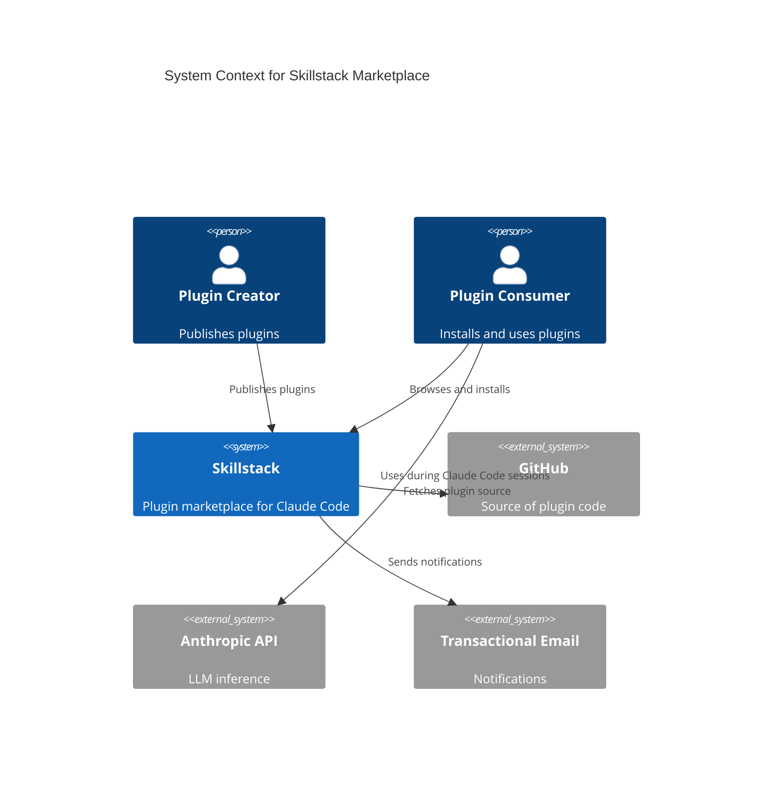
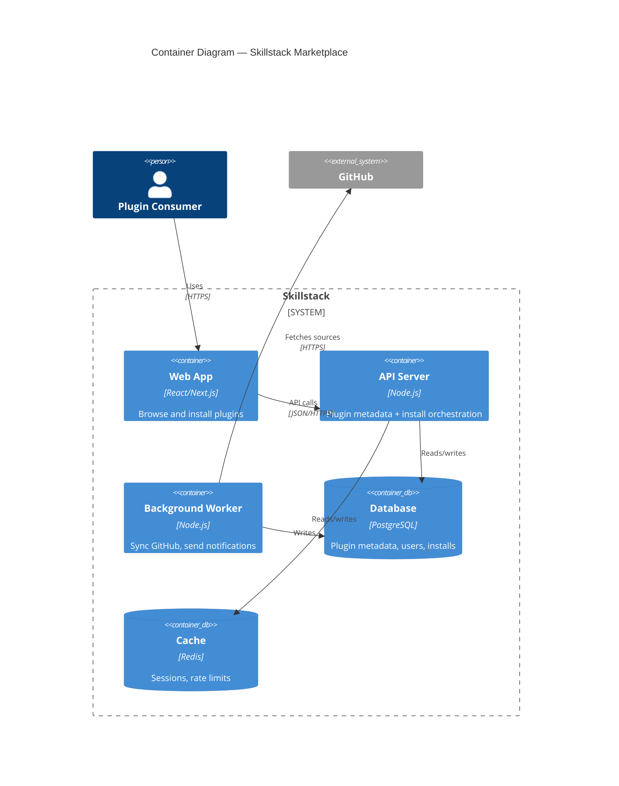
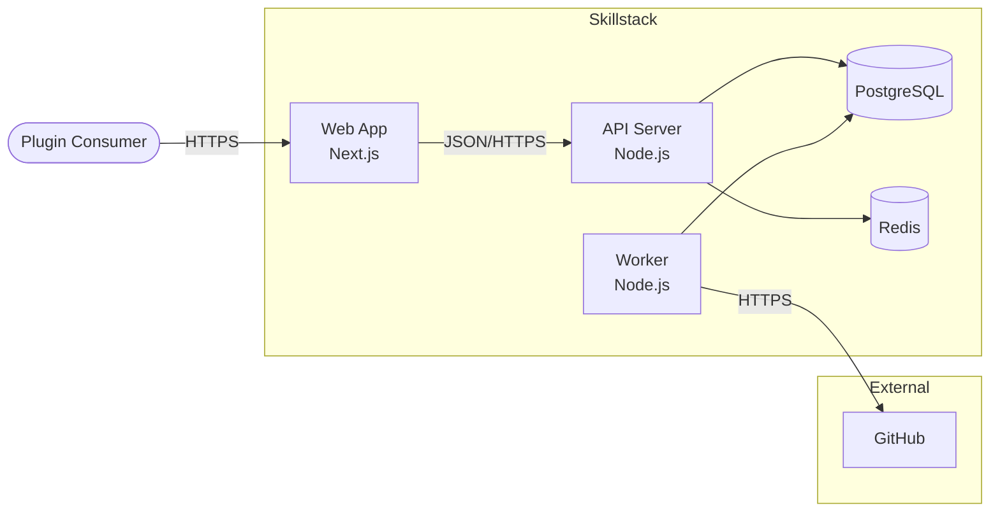

# C4 Model Guide

The C4 model, from Simon Brown, provides a consistent way to diagram software architecture at four zoom levels: Context, Container, Component, Code. Most teams need only the top two. The discipline: each level answers one question, and zooming in/out doesn't require redrawing.

## The four levels

### Level 1 — System Context

**Question:** "What is this system, at the highest level, in relation to its users and other systems?"

**Shows:**
- The system you're building (one box).
- People who use it.
- Other systems it depends on or is depended on by.

**Audience:** Anyone — stakeholders, executives, new joiners on their first day.

**What NOT to show:** Internal structure of the system. That's the next level.

### Level 2 — Container

**Question:** "What are the major applications and data stores inside my system?"

**Shows:**
- Applications / services (containers in the C4 sense — not Docker containers, though they overlap).
- Databases and other data stores.
- Communication between containers (with protocol / sync/async annotation).
- External systems at the boundary.

**Audience:** Tech leads, architects, developers orienting to the system.

**What NOT to show:** Internal code structure of any container. That's the next level.

### Level 3 — Component

**Question:** "What are the major components inside a specific container?"

**Shows:**
- Components (controllers, services, repositories) inside one container.
- Relationships between components.

**Audience:** Developers working on that container.

**When to draw:** Only for complex containers. Most containers don't need a component diagram.

### Level 4 — Code

**Question:** "What are the classes / structures inside a specific component?"

**Shows:**
- UML class diagram for one component.

**Audience:** Developers deep in the component.

**When to draw:** Rarely. Most teams never produce Level 4.

## Worked Context diagram

What this shows: the system boundaries are explicit. Internal detail is absent. A reader unfamiliar with the system learns what it is in 30 seconds.

## Worked Container diagram

What this shows: major applications and data stores, the communication between them with protocols. A tech lead can understand the system in 1-2 minutes.

## Alternative syntax (non-C4)

If the C4 Mermaid extension isn't available, draw equivalent diagrams as regular flowcharts with clear conventions:

Include a legend explaining: rectangles = applications, cylinders = data stores, stadiums = people / external systems.

## Rules for C4

### Rule 1 — One question per level

Each level answers one question. Don't mix:
- Context: "what is the system?"
- Container: "what's inside the system?"
- Component: "what's inside this container?"
- Code: "what's inside this component?"

### Rule 2 — Each level fits on one screen

If your diagram is 40+ boxes or doesn't fit a screen, you either:
- Need to zoom OUT (abstract to higher level).
- Need to SPLIT (multiple diagrams at same level).

### Rule 3 — Consistency of shapes and styles

Decide up-front:
- Shape for people
- Shape for containers / applications
- Shape for data stores
- Shape for external systems

Then use consistently across all diagrams. A legend is mandatory.

### Rule 4 — Label every arrow

Unlabeled arrows are puzzles. Every arrow gets:
- What flows (data, request, event)
- Protocol if relevant (HTTPS, gRPC, AMQP)
- Sync/async if relevant

### Rule 5 — Skip Level 3/4 unless needed

Most teams benefit from Level 1 + Level 2 only. Level 3 for complex services. Level 4 rarely.

### Rule 6 — Zoom doesn't mean add detail

Zooming in shouldn't require re-reading the higher-level diagram. Each level stands alone.

## When to draw which level

| Situation | Draw |
|---|---|
| Explaining the system to a new joiner | Context + Container |
| Architecture review | Container (primary), Component for complex services |
| Onboarding docs | Context (in overview) |
| Incident post-mortem | Container (shows what failed and where) |
| Product pitch | Context (external audience) |
| Design review for a specific service | Component diagram for that service |
| Code review | Usually no diagram — readers have the code |

## C4 vs other architecture diagram styles

| Style | Strength | Weakness |
|---|---|---|
| **C4** | Consistent zoom levels; clear audience per level; industry-known | Requires commitment to the model |
| **UML component diagrams** | Formal notation | Heavy; fewer readers know it; often over-specified |
| **Ad-hoc flowcharts** | Flexible; easy to draw | No conventions; hard to compare across diagrams |
| **Deployment diagrams** | Good for infrastructure view | Not good for application structure |
| **Dataflow diagrams** | Good when data flow is the main concern | Miss non-data interactions |

C4's advantage: consistency. If your team always produces Context + Container diagrams, everyone knows what to expect and where to look.

## Common mistakes

### Mistake 1 — Mixing levels

**Symptom:** A single diagram shows external systems, internal applications, and internal code classes all together.

**Fix:** Split into two or three diagrams at appropriate levels.

### Mistake 2 — Too detailed at Context level

**Symptom:** Context diagram shows internal containers.

**Fix:** Context shows the system as ONE box. Internal structure goes in Container.

### Mistake 3 — Too abstract at Container level

**Symptom:** Container diagram is just the Context diagram relabeled.

**Fix:** Container shows ALL applications and data stores inside the system, with communication between them.

### Mistake 4 — Missing legend

**Symptom:** Readers ask "what do the different shapes mean?"

**Fix:** Every C4 diagram has a legend.

### Mistake 5 — Inconsistent styles across diagrams

**Symptom:** People are rectangles in one diagram, stadiums in another.

**Fix:** Establish conventions, document in a style guide, reuse.

### Mistake 6 — Not updating the diagram with the system

**Symptom:** Diagram shows state from 18 months ago.

**Fix:** Diagram-as-code in the repo, updated in the PR that changes the system. Covered in the SKILL.

### Mistake 7 — Drawing Level 4 (code)

**Symptom:** Team produces UML class diagrams routinely.

**Fix:** Level 4 is rarely needed. If you're tempted to draw it, consider whether a link to the actual code would serve readers better.

## Adoption path

If your team hasn't used C4 before:

1. **Draw one Context diagram** for your main system. 30 minutes.
2. **Draw one Container diagram** for the same system. 1-2 hours including discussion.
3. **Commit both to the repo** at `docs/architecture/`.
4. **Reference them** in the README and in RFCs.
5. **Update them** when the system changes.
6. **Draw Component diagrams only if needed** — don't treat it as a box-checking exercise.

Two diagrams, maintained, beats ten diagrams written once and abandoned.
