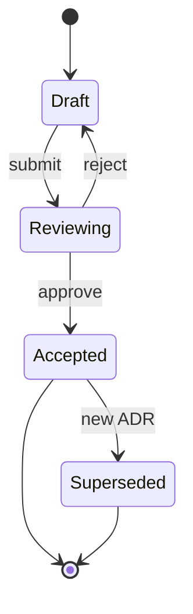

# Diagram Selection Matrix

Not every idea deserves a diagram. When a diagram is right, the type matters. This matrix maps what you're trying to show to the right diagram type — and calls out when no diagram beats any diagram.

## The primary matrix

| What you want to show | Best diagram | Why |
|---|---|---|
| A process with branches and decisions | Flowchart | Visual branching; decision diamonds are intuitive |
| Who talks to whom, when, in what order | Sequence diagram | Time axis + participants separates concerns |
| Possible states of an entity and transitions | State diagram | States + events are explicit |
| Data model / schema | ER diagram | Cardinality notation communicates relationships |
| High-level system architecture | C4 context / container | Zoom levels, external actors, containers |
| Components inside a service | C4 component | One level down from container |
| Code structure (classes, inheritance) | Class diagram | Inheritance / composition / visibility |
| Version control history | Git graph | Branches and merges visually |
| 2x2 trade-off (effort vs impact, etc.) | Quadrant chart | Immediate visual ranking |
| User's journey across touchpoints | Journey map | Emotional / experiential arc |
| System dependencies | Dependency graph | Who depends on whom |
| Proportions of a whole | Pie chart (rarely) | Part-to-whole, but bar chart is usually better |
| Value over time | Line chart (not Mermaid) | Use a real charting library |

## The inverse matrix — when NO diagram is right

| Signal | Do instead |
|---|---|
| Information is primarily narrative | Prose |
| Fewer than 3 steps or entities | Bulleted list |
| Exact values matter more than relationships | Table |
| Content changes often | Prose — diagrams go stale faster |
| Diagram would have 30+ nodes | Split into multiple or abstract up a level |
| You want to show nuance, caveats | Prose can carry nuance; diagrams compress |
| Reader needs to cite or quote specific points | Prose or table — more extractable |

Rule of thumb: if describing the thing in prose takes fewer than 3 paragraphs AND the structure is linear, prose wins.

## Choosing by question

Diagrams answer specific questions. Work from question to diagram type.

### "What happens and in what order?"

→ Flowchart if there are branches and decisions.
→ Bulleted list if strictly linear.

### "Who does what, and in what order?"

→ Sequence diagram (participants + time axis).

### "What state is this in and how does it change?"

→ State diagram (states + events).

### "How is this built?" (high-level)

→ C4 context diagram if focused on "this system and its neighbors."
→ C4 container if focused on "services/apps inside this system."

### "How is this built?" (detailed)

→ C4 component if showing a service's internals.
→ Class diagram if showing OO code structure.
→ Rarely: Code-level C4.

### "What talks to what?"

→ Dependency graph if static.
→ Sequence diagram if ordered over time.

### "How does the data fit together?"

→ ER diagram.

### "How do I choose between these options?"

→ Quadrant chart (2 dimensions) or table (N dimensions).

### "What is the user's experience?"

→ Journey map.

## Worked examples

### Example 1 — wrong diagram chosen

**Goal:** Show how an order progresses through our system.

**Wrong choice:** Flowchart with 25 boxes.

**Why wrong:** The flow is long and linear, with some branches. A flowchart works but ends up crowded and hard to read at 25 boxes.

**Better:** Split into two diagrams by zoom level:
- High-level: Context or container C4 showing "Order Service → Payment Service → Fulfillment Service" with 4-5 key transitions.
- Detailed: Sequence diagram for the most complex interaction (e.g., payment with retry).

### Example 2 — diagram beats prose

**Goal:** Document the RFC lifecycle: Draft → Reviewing → (Draft or Accepted) → Superseded.

**Prose version:** "An RFC starts in Draft. The author submits it, moving to Reviewing. From Reviewing, it can move back to Draft (if rejected with feedback) or forward to Accepted (if approved). An Accepted RFC can later be superseded by a newer RFC, at which point its status changes to Superseded."

**Diagram version:**


The state diagram takes ~10 seconds to read; the prose takes ~30 seconds and loses clarity on transitions. Diagram wins.

### Example 3 — prose beats diagram

**Goal:** Explain why we chose PostgreSQL over MongoDB.

**Wrong instinct:** Decision flowchart with considerations.

**Why wrong:** The reasoning is nuanced, weighted, and caveated. A flowchart compresses it to "if relational → PG; if document → Mongo" which misses the actual decision drivers.

**Better:** A decision doc (from `documentation-discipline`) or a section in an ADR with Pros/Cons/Trade-offs. Prose with a table.

## Decision tree

```
Do you need a diagram at all?
│
├── Content is narrative / nuanced → NO diagram (prose)
├── Fewer than 3 items → NO diagram (list)
├── Exact values matter → NO diagram (table)
└── YES, diagram → keep going
    │
    ├── Time-ordered interaction between actors?
    │   └── Sequence diagram
    │
    ├── Branching process with decisions?
    │   └── Flowchart
    │
    ├── States + transitions?
    │   └── State diagram
    │
    ├── Data model / entities + relationships?
    │   └── ER diagram
    │
    ├── System architecture (high or mid level)?
    │   └── C4 (context / container / component)
    │
    ├── Two-dimensional comparison?
    │   └── Quadrant chart
    │
    └── Something else?
        └── Table or prose (likely)
```

## Audience matters

Some diagram types assume prior knowledge:

| Diagram type | Prerequisite knowledge |
|---|---|
| UML class diagram | OO programming |
| C4 model | Familiarity with C4 conventions (or a legend) |
| Sequence diagram with alt/opt | Basic understanding of "alt" control flow |
| ER diagram with cardinality | Relational DB concepts |

When writing for mixed audiences:
- **Include a legend** for non-trivial diagrams.
- **Annotate transitions** — unlabeled arrows force guessing.
- **Start with context** — one-paragraph intro before the diagram.

## The pre-diagram checklist

Before drawing:

- [ ] Can I state what I want the diagram to show in one sentence? (If not, the scope is fuzzy.)
- [ ] Is a diagram better than prose here? (Apply the inverse matrix.)
- [ ] Who is the audience? Do they know this diagram type?
- [ ] How many nodes / entities / states will this diagram have? (If > 15, split or abstract.)
- [ ] Will this diagram need to be maintained? Who owns it?

## Common mistakes

- **Decoration diagrams.** Added because docs look incomplete. Delete them.
- **Wrong diagram type.** Flowchart where sequence was needed, or vice versa.
- **Too many nodes.** 40 boxes, 80 arrows — unreadable. Split into multiple diagrams or zoom up a level.
- **Missing labels.** Unlabeled arrows force readers to guess.
- **Mixed shape semantics.** One diagram uses rectangles for services AND for events AND for databases. Pick consistent shapes.
- **Image files.** PNG/JPG that go stale with no one noticing. Prefer diagram-as-code.
- **Over-specificity.** Diagram shows every retry, every error path. Abstract up — readers want main flow, then details on demand.
- **Under-specificity.** Diagram is so abstract it doesn't communicate anything new. Either add detail or delete.
