# Mermaid Cheat Sheet

Complete syntax reference for the Mermaid diagrams most useful for engineering documentation. Paste-ready snippets with the conventions explained.

## Flowchart

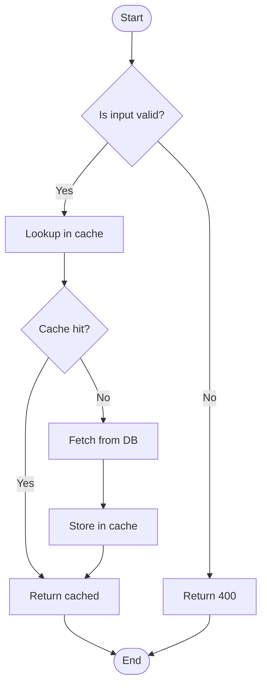

### Direction

- `TD` / `TB` — top to bottom
- `LR` — left to right
- `BT` / `RL` — **avoid**; readers expect TD or LR

### Node shapes

| Syntax | Shape | Use for |
|---|---|---|
| `A[Label]` | Rectangle | Action / step |
| `A(Label)` | Rounded rectangle | Action / step (softer) |
| `A([Label])` | Stadium | Start / end |
| `A[[Label]]` | Subroutine | Sub-process |
| `A[(Label)]` | Cylinder | Database / storage |
| `A((Label))` | Circle | State |
| `A{Label}` | Rhombus | Decision |
| `A{{Label}}` | Hexagon | Preparation / setup |
| `A[/Label/]` | Parallelogram | Input / output |
| `A[\Label\]` | Parallelogram alt | Input / output |

### Arrows

| Syntax | Type |
|---|---|
| `A --> B` | Solid arrow |
| `A ==> B` | Thick solid arrow (emphasis) |
| `A -.-> B` | Dashed arrow |
| `A --x B` | Arrow with X (termination) |
| `A --o B` | Arrow with circle (aggregation) |
| `A -- text --> B` | Labeled arrow |
| `A -->|text| B` | Alternate labeled arrow |

### Subgraphs

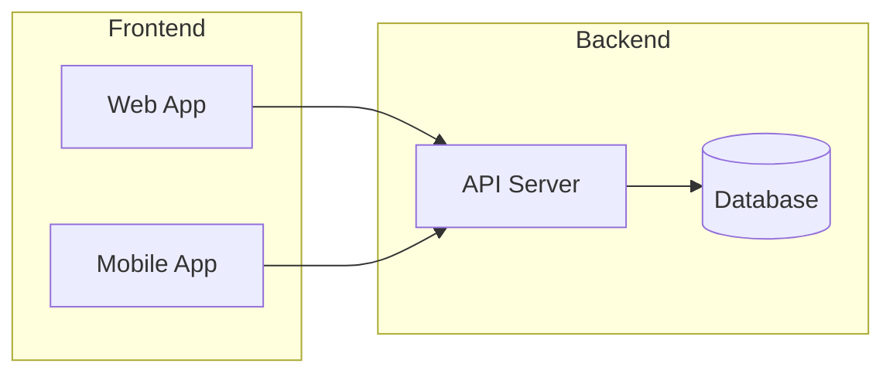

## Sequence diagram

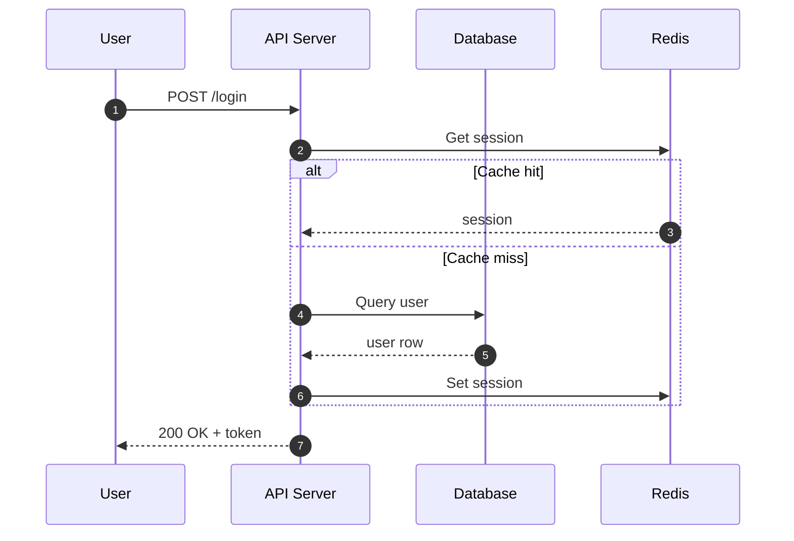

### Arrows

| Syntax | Type |
|---|---|
| `A->>B: msg` | Solid arrow (synchronous) |
| `A-->>B: msg` | Dashed arrow (async / return) |
| `A-xB: msg` | Arrow with X (failed / terminated) |
| `A-)B: msg` | Open arrow (async message) |

### Control flow

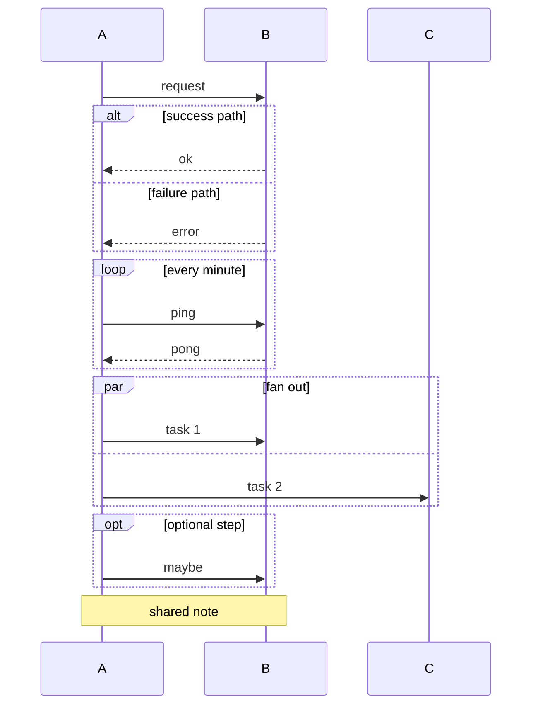

### Useful directives

- `autonumber` — numbers each step (adds referenceability).
- `participant X as "Long name"` — short ID, full label.
- `activate A` / `deactivate A` — shows lifelines.

## State diagram

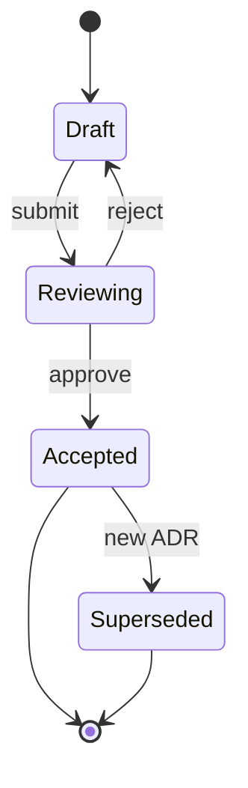

### Composite states

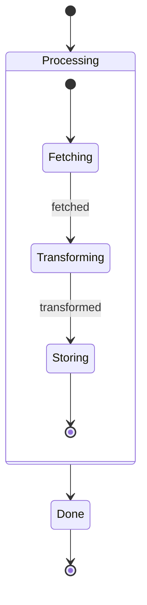

### Parallel regions

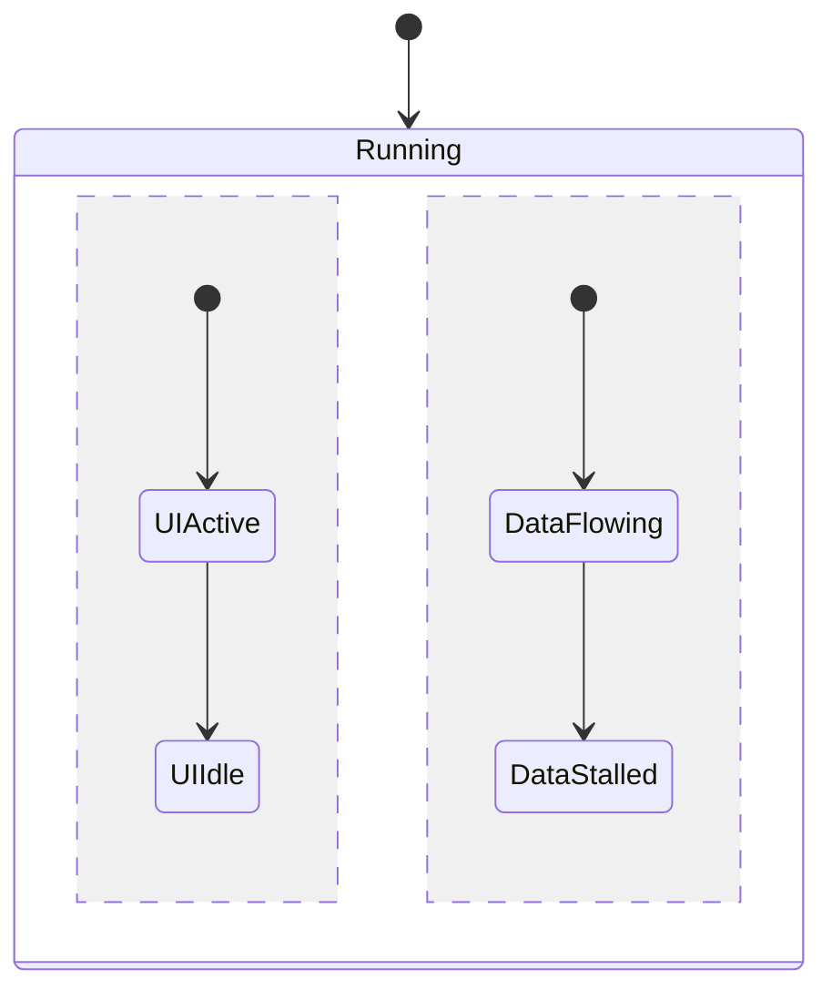

## ER diagram

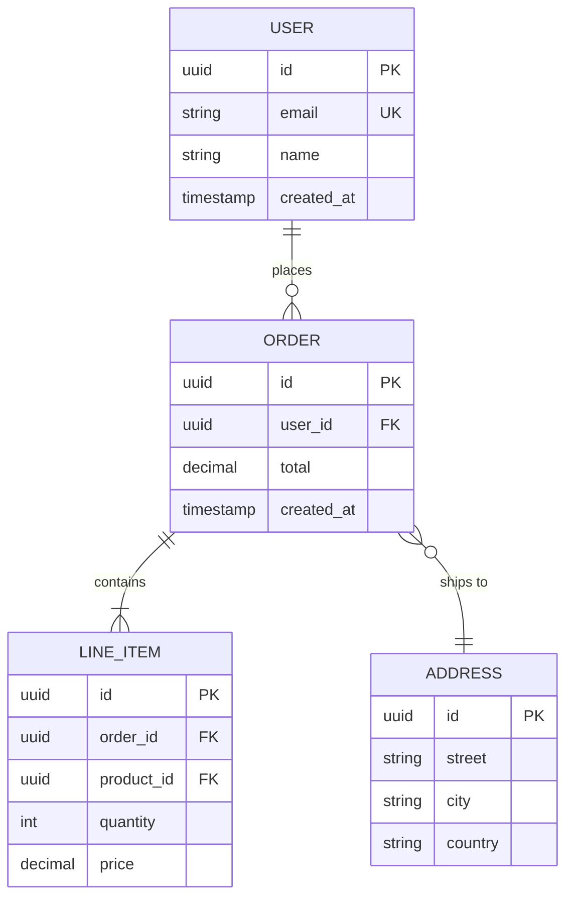

### Cardinality

| Syntax | Meaning |
|---|---|
| `||--||` | Exactly one to exactly one |
| `||--o{` | One to zero-or-many |
| `||--|{` | One to one-or-many |
| `}o--o{` | Zero-or-many to zero-or-many |
| `}|--|{` | One-or-many to one-or-many |

Read left-to-right: `A ||--o{ B` = "one A has zero-or-many B".

### Key types

- `PK` — primary key
- `FK` — foreign key
- `UK` — unique key

## Class diagram

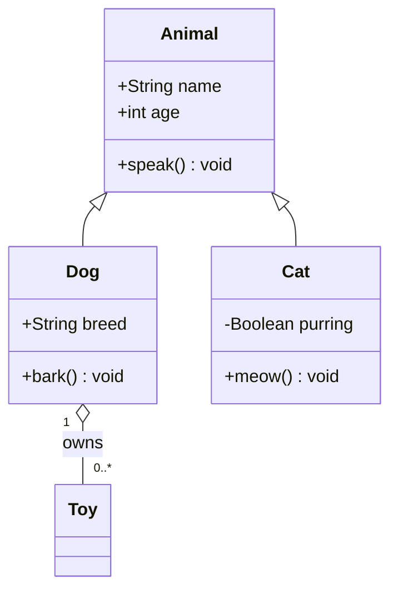

### Relationships

| Syntax | Meaning |
|---|---|
| `<|--` | Inheritance |
| `<|..` | Realization (implements) |
| `o--` | Aggregation |
| `*--` | Composition |
| `<--` | Association |
| `..>` | Dependency |

### Visibility

- `+` public
- `-` private
- `#` protected
- `~` package

## Git graph

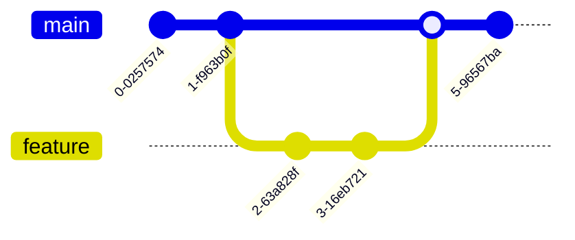

## Pie chart

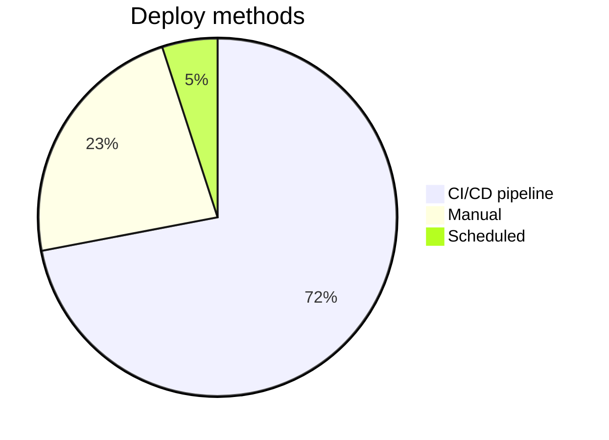

## Quadrant chart

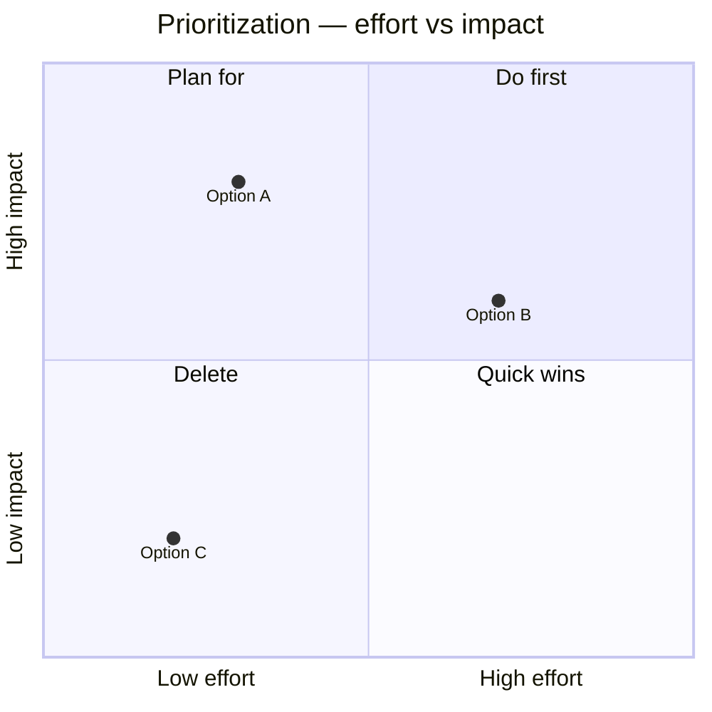

## Journey map

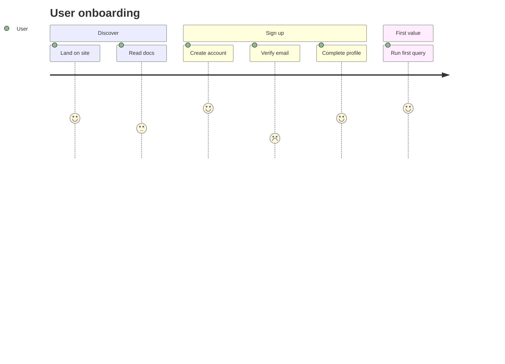

## Configuration tips

### Themes

Add at top of diagram:

```
%%{init: {'theme':'base', 'themeVariables': { 'primaryColor': '#fff' }}}%%
```

Available themes: `default`, `neutral`, `dark`, `forest`, `base` (customizable).

### Rendering notes

- GitHub renders Mermaid natively in `.md` files and PR descriptions.
- GitLab renders natively.
- Notion renders in code blocks with `mermaid` language tag.
- VS Code needs the Mermaid extension for preview.
- For static export: `@mermaid-js/mermaid-cli` (`mmdc -i input.mmd -o output.svg`).

## Common mistakes

- **BT/RL direction** — readers expect TD or LR; inverse directions feel wrong.
- **Missing arrow labels** — every arrow in a decision flow should be labeled.
- **Too many nodes** — over ~15 nodes becomes unreadable; split or abstract.
- **Mixed shapes for same meaning** — pick one shape per concept (e.g., rounded rect = action always).
- **No legend for non-standard shapes** — unusual shapes without explanation confuse readers.
- **alt without end** — Mermaid won't render; every `alt` needs an `end`.
- **Unescaped special characters** — `<`, `>`, `|` in labels break rendering; use HTML entities or rewrite.
