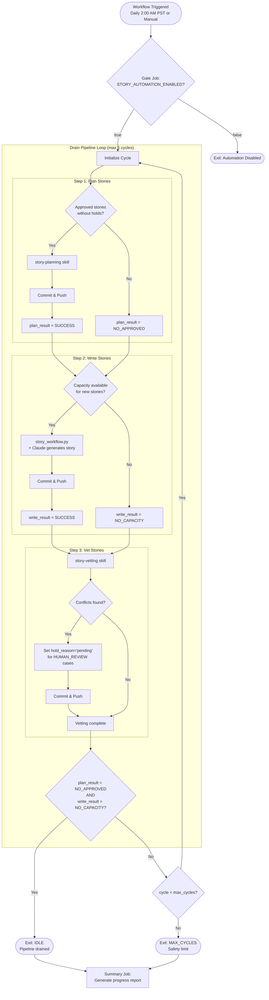
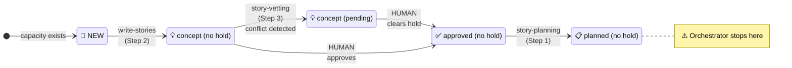

# Current Orchestrator Workflow (As Implemented)

This diagram shows the **actual current state** of the story-tree automation as it exists today.

---

## Overview

The current system has **two parallel automation patterns**:

1. **Orchestrator Loop** - A drain-pipeline loop that processes Plan→Write→Vet (runs first)
2. **Standalone Workflows** - Individual scheduled workflows that run at fixed times (DRAIN-FIRST order)

---

## Standalone Workflow Sequence (Time-Based)

These workflows run independently on a daily schedule, ordered from later stages to earlier stages (DRAIN-FIRST):

```mermaid
flowchart TB
    subgraph "Daily Schedule (PST) - DRAIN FIRST"
        direction LR
        T0["2:00 AM - Orchestrator"]
        T1["2:20 AM - ready-check"]
        T2["2:40 AM - verify-stories"]
        T3["3:00 AM - review-stories"]
        T4["3:20 AM - execute-stories"]
        T5["3:40 AM - activate-stories"]
        T6["4:00 AM - plan-stories"]
        T7["4:20 AM - approve-stories"]
        T8["4:40 AM - write-stories"]
    end

    subgraph "ready-check.yml"
        RC1["implemented (no hold)"] -->|"integration OK"| RC2["ready"]
        RC1 -->|"build/tests fail"| RC3["implemented (broken)"]
    end

    subgraph "verify-stories.yml"
        V1["verifying (no hold)"] -->|"tests pass"| V2["implemented"]
        V1 -->|"tests fail"| V3["verifying (broken)"]
    end

    subgraph "review-stories.yml"
        R1["reviewing (no hold)"] -->|"review passed"| R2["verifying"]
        R1 -->|"issues found"| R3["reviewing (broken)"]
    end

    subgraph "execute-stories.yml"
        E1["active (no hold)"] -->|"blocking issues"| E2["active (paused)"]
        E1 -->|"deferrable issues"| E3["reviewing"]
        E1 -->|"no issues"| E4["verifying"]
    end

    subgraph "activate-stories.yml"
        A1["planned (blocked)"] -->|"blockers resolved"| A2["planned (no hold)"]
        A2 -->|"deps met"| A3["active"]
        A2 -->|"deps unmet"| A4["planned (blocked:IDs)"]
    end

    subgraph "plan-stories.yml"
        P1["approved (no hold)"] -->|"create TDD plan"| P2["planned"]
    end

    subgraph "approve-stories.yml (HUMAN ONLY)"
        AP1["Reports concepts<br/>awaiting approval"] -->|"NO AUTO-APPROVE"| AP2["Human reviews manually"]
    end

    subgraph "write-stories.yml"
        W1[NEW] -->|"capacity check"| W2["concept"]
    end

    T0 --> Orchestrator
    T1 --> RC1
    T2 --> V1
    T3 --> R1
    T4 --> E1
    T5 --> A1
    T6 --> P1
    T7 --> AP1
    T8 --> W1
```

---

## Orchestrator Loop (story-tree-orchestrator.yml)

The orchestrator runs a **drain-pipeline loop** that processes stories through three steps per cycle:

---

## Stage Transitions Covered by Current Orchestrator

---

## What's NOT in the Current Orchestrator

The orchestrator only handles Plan→Write→Vet. All other transitions are handled by standalone workflows:

| From Stage | To Stage | Current Handler | Status |
|------------|----------|-----------------|--------|
| `concept` | `approved` | Human manual | ✅ By design (approve-stories.yml reports only) |
| `planned` | `active` | `activate-stories.yml` | ✅ Standalone (3:40 AM PST) |
| `planned` | `blocked:IDs` | `activate-stories.yml` | ✅ Standalone (3:40 AM PST) |
| `active` | `reviewing` | `execute-stories.yml` | ✅ Standalone (3:20 AM PST) |
| `active` | `verifying` | `execute-stories.yml` | ✅ Standalone (3:20 AM PST) |
| `active` | `paused` | `execute-stories.yml` | ✅ Standalone (3:20 AM PST) |
| `reviewing` | `verifying` | `review-stories.yml` | ✅ Standalone (3:00 AM PST) |
| `verifying` | `implemented` | `verify-stories.yml` | ✅ Standalone (2:40 AM PST) |
| `implemented` | `ready` | `ready-check.yml` | ✅ Standalone (2:20 AM PST) |
| `ready` | `released` | `deploy.yml` | ✅ Manual trigger (production branch) |

---

## Current Workflow File Summary

| Workflow | Schedule (PST) | Transitions | Model | Status |
|----------|----------------|-------------|-------|--------|
| `story-tree-orchestrator.yml` | 2:00 AM | approved→planned, NEW→concept, conflict→pending | Opus (plan), Sonnet (write/vet) | ✅ Main Loop |
| `ready-check.yml` | 2:20 AM | implemented→ready/broken | Sonnet | ✅ Standalone |
| `verify-stories.yml` | 2:40 AM | verifying→implemented/broken | Sonnet | ✅ Standalone |
| `review-stories.yml` | 3:00 AM | reviewing→verifying/broken | Opus | ✅ Standalone |
| `execute-stories.yml` | 3:20 AM | active→reviewing/verifying/paused | Sonnet | ✅ Standalone |
| `activate-stories.yml` | 3:40 AM | planned→active/blocked:IDs | Sonnet | ✅ Standalone |
| `plan-stories.yml` | 4:00 AM | approved→planned | Opus | ✅ Standalone |
| `approve-stories.yml` | 4:20 AM | (reports only) | N/A | ✅ Human-only |
| `write-stories.yml` | 4:40 AM | NEW→concept | Sonnet | ✅ Standalone |
| `deploy.yml` | Manual | ready→released | N/A | ✅ Production branch |

**Note**: Standalone workflows follow a DRAIN-FIRST pattern - later stages (ready-check) run before earlier stages (write-stories) to make room in the pipeline.

---

*Updated: 2025-12-18*
